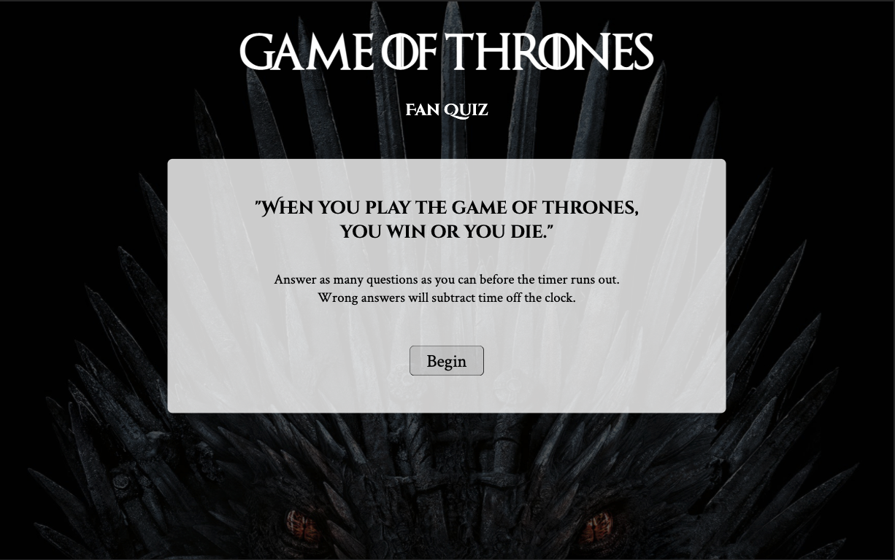
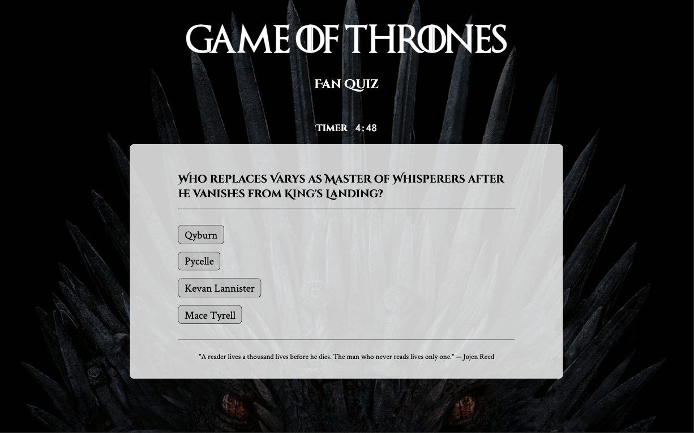
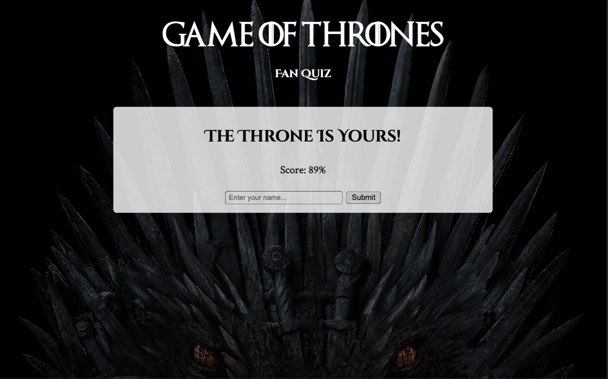

# Game of Thrones Quiz

## Table of Contents
* [Project Summary](##project-summary)
* [Technologies Used](##technologies-used)
* [Example Code](##example-code)
* [How to Access](##how-to-access)
* [About Me](##about-me)
* [Screenshots](##screenshots)
* [Give Credit Where It's Due](##resource-reference)
---

## Project Summary
This is a Game of Thrones themed quiz consisting of 20 questions and set to a timer. Wrong answers will decrease the timer. Correct answers will be scored and a percentage will display at the end. Player names and scores are stored in a database and the most recent players are displayed.

## Technologies Used
* [JavaScript](https://developer.mozilla.org/en-US/docs/Web/JavaScript)
* [MongoDB](https://www.mongodb.com/)
* [Express.js](https://expressjs.com/)
* [React.js](https://reactjs.org/)
* [Node.js](https://nodejs.org/en/about/)
* [CSS3](https://developer.mozilla.org/en-US/docs/Archive/CSS3)

## Example Code
A simple timer component.
```javascript
function Timer(props) {
  let seconds = parseInt(props.time % 60, 10);
  let minutes = parseInt(props.time / 60);

  seconds = seconds < 10 ? '0' + seconds : seconds;

  return (
    <div id="timer">
      Timer 
      <span id="countdown">{minutes}:{seconds}</span>
    </div>
  )
}
```
Update timer with useEffect.
```javascript
function Game() {
  const [time, setTime] = useState(300);
  const [timerActive, setTimerActive] = useState(false);

  useEffect(() => {
    if (timerActive && time > 0) {
      const interval = setInterval(() => {
        setTime(time => time - 1)
      }, 1000);
      return () => clearInterval(interval);
    }
  }, [timerActive, time])
```
Display/Hide different components.
```javascript
const [showWelcome, setShowWelcome] = useState(true);
const [showQuiz, setShowQuiz] = useState(false);
const displayQuiz = () => {
  setShowWelcome(false);
  setShowQuiz(true);
  props.setTimerActive(true);
}
```
Database model for questions in Mongoose.js
```javascript
const mongoose = require('mongoose');
const Schema = mongoose.Schema;

const questionSchema = new Schema({
  q: { type: String },
  a: [{ type: String }],
  correct: { type: String },
  footnote: { type: String }
});

const Question = mongoose.model("Question", questionSchema);

module.exports = Question;
```


## How to Access
[Game of Thrones Quiz](https://game-of-thrones-quiz.herokuapp.com/)

## About Me
* [LinkedIn](www.linkedin.com/in/the-real-jordan-kelly)
* [GitHub](https://github.com/profjjk)

## Screenshots




## Resource Reference
Images:
* [Background Image](https://media1.popsugar-assets.com/files/thumbor/RULArzi8uqr7dtQN78pzJIG1MBc/fit-in/2048xorig/filters:format_auto-!!-:strip_icc-!!-/2020/04/08/960/n/1922507/c39129f5495d5fb5_game_of_thrones/i/Game-Thrones-Zoom-Background.jpg)

Custom font:
* [Game of Thrones font](https://fontmeme.com/fonts/game-of-thrones-font/)
* [Font Squirrel](https://www.fontsquirrel.com/)

Quiz questions:
* [Clay's Quiz](https://www.allthetests.com/tests-for-the-real-fan/books-quizzes/other-books/quiz31/1418776957/game-of-thrones-book-1-5-quiz)
* [Jinny's Quiz](https://www.goodreads.com/quizzes/9484-a-song-of-ice-and-fire-quiz)
* [The Guardian's Quiz](https://www.theguardian.com/tv-and-radio/quiz/2015/apr/11/game-of-thrones-quiz)

Fun facts & quotes:
* [GoT fun facts](https://www.boredpanda.com/game-of-thrones-facts/?utm_source=google&utm_medium=organic&utm_campaign=organic)
* [GoT quotes](https://reedsy.com/discovery/blog/best-game-of-thrones-quotes)